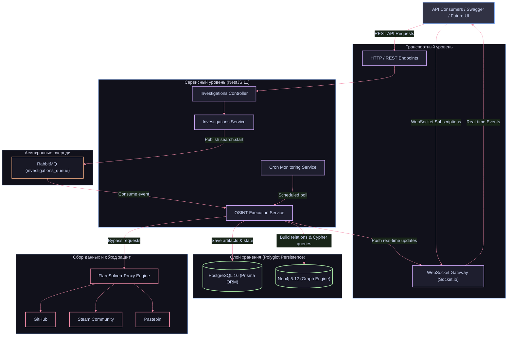

# 🌐 OSINT Platform: Distributed Intelligence & Graph Correlation Engine

Исследовательский проект, сфокусированный на бэкенд-архитектуре, глубоком изучении графовых СУБД (Neo4j), гибридного хранения данных (**Polyglot Persistence**) и проектировании асинхронных пайплайнов сбора информации на NestJS.

[Backend (Основной сервис) →](./backend/README.md) | [Frontend (Шаблон / WIP) →](./frontend/README.md)

---

## Архитектурный обзор

Основной упор проекта сделан на серверную инженерию: обработку очередей через RabbitMQ, интеграцию обхода Cloudflare (FlareSolverr), стриминг промежуточных результатов через WebSockets и семантический анализ цифрового следа с построением графа связей в Neo4j.



---

## Ключевые архитектурные решения

- **Графовый анализ взаимосвязей (Neo4j & Cypher)**: Использование графовой модели данных для сопоставления разрозненных аккаунтов, мест работы, локаций и биографий с объединением в семантическую сеть.
- **Гибридное хранение (Polyglot Persistence)**: Разделение зон ответственности: реляционная БД (PostgreSQL 16 + Prisma) хранит метаданные расследований, сессии и сырые артефакты, а Neo4j вычисляет топологию графа.
- **Асинхронная архитектура (RabbitMQ)**: Декомпозиция входящих HTTP-запросов и тяжелых задач скрейпинга через брокер очередей.
- **Обход Cloudflare (FlareSolverr)**: Интеграция прокси-движка для преодоления WAF и антибот-проверок целевых платформ.
- **Реактивный стриминг (Socket.io)**: WebSocket-шлюз с комнатами по `investigationId` для доставки промежуточного прогресса и найденных артефактов без блокирующего поллинга.
- **Фоновый мониторинг (@nestjs/schedule)**: Cron-сервис регулярного обновления целевых профилей с контролем лимитов выполнения.

---

## Стек технологий

| Слой | Технология | Назначение |
| :--- | :--- | :--- |
| Backend Runtime | Node.js / TypeScript | Серверная среда исполнения |
| Framework | NestJS 11 | Архитектура, контроллеры, сервисы и микросервисы |
| Graph Database | Neo4j 5.12 Community | Хранение семантического графа связей и Cypher-запросы |
| Relational Storage | PostgreSQL 16 | Хранение состояний, пользователей и сырых артефактов |
| ORM Layer | Prisma 7 + @prisma/adapter-pg | Типобезопасный доступ к PostgreSQL |
| Message Broker | RabbitMQ 3 | Асинхронная очередь задач сбора (`search.start`) |
| Real-time | WebSockets / Socket.io | Стриминг прогресса расследования |
| Anti-Bot Proxy | FlareSolverr + Cheerio | Проксирование запросов и парсинг HTML |
| Scheduler | @nestjs/schedule | Периодические задачи циклического мониторинга |
| Authentication | Better Auth | Подсистема аутентификации и сессий |
| Infrastructure | Docker & Docker Compose | Контейнеризация PostgreSQL, RabbitMQ, Neo4j, FlareSolverr |
| Frontend | React 19 + Vite (WIP) | Базовый каркас клиента под будущую визуализацию |

---

## Топология графовой модели данных

В графовой базе Neo4j аккумулируются связи между сущностями:

```
(:Investigation) --[:HAS_ACCOUNT]--> (:Account)
(:Account) --[:WORKED_IN]--> (:Company)
(:Account) --[:LOCATED_IN]--> (:Location)
(:Account) --[:ACCOUNT_BIO]--> (:Bio)
```

Пример Cypher-запроса из кодовой базы для извлечения сетевых взаимосвязей цели:
```cypher
MATCH (i:Investigation {id: $id})-[r:HAS_ACCOUNT]->(a:Account)
RETURN a.source AS source, a.url AS url;
```

---

## Быстрый старт

### Требования
- Docker и Docker Compose
- Node.js >= 20.x
- pnpm >= 9.x

### 1. Подготовка окружения
```bash
git clone https://github.com/platon453/OSINT.git
cd OSINT
cp .env.example .env
```

### 2. Запуск контейнеров инфраструктуры
```bash
docker compose up -d
```

Панели управления сервисами:
- Neo4j Browser: `http://localhost:7474`
- RabbitMQ Management: `http://localhost:15672` (guest / guest)
- FlareSolverr: `http://localhost:8191`
- PostgreSQL: порт `5432`

### 3. Запуск основного сервиса (Backend)
```bash
cd backend
pnpm install
npx prisma migrate dev
pnpm run start:dev
```
API доступно на `http://localhost:3000`.  
Интерактивная Swagger-документация: `http://localhost:3000/api/docs`.

---

## Структура репозитория

```
├── backend/                  # Основной сервис: NestJS, воркеры, Prisma, Neo4j
│   ├── prisma/               # Схема Prisma и миграции PostgreSQL
│   ├── src/
│   │   ├── auth/             # Модуль аутентификации Better Auth
│   │   ├── investigations/   # Контроллеры, RabbitMQ и WebSocket Gateway
│   │   ├── neo4j/            # Сервис работы с графовой СУБД (Cypher)
│   │   ├── prisma/           # Доступ к PostgreSQL
│   │   └── tasks/            # Фоновый мониторинг по расписанию (Cron)
│   └── test/                 # Тестовые сценарии
├── frontend/                 # Каркас SPA-клиента (Vite, React 19, заготовка)
├── docker-compose.yaml       # Инфраструктура (Postgres, RabbitMQ, Neo4j, FlareSolverr)
├── .env.example              # Шаблон конфигурации переменных окружения
└── README.md                 # Документация проекта
```

---

## Лицензия

Проект распространяется под лицензией MIT. Подробности в файле [LICENSE](./LICENSE).
